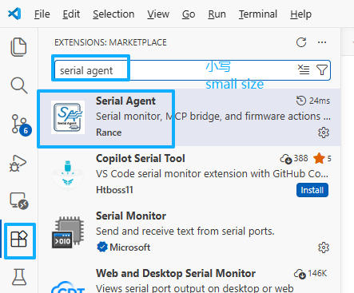
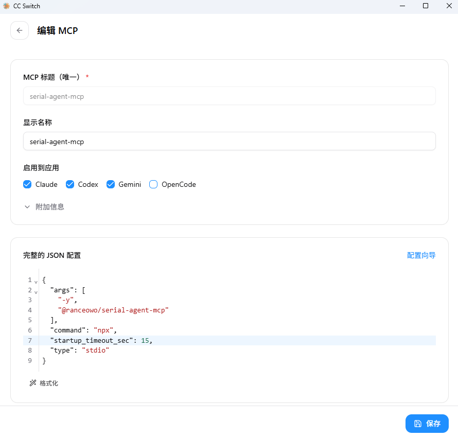

# Serial Agent

English version: [README_EN.md](README_EN.md)

`Serial Agent` 是一个面向嵌入式串口调试与闭环验证场景的 AI 平台。它把 VS Code 插件、MCP 和 Skill 串成一条可复用的工作流，让你能把“看日志、发命令、分析问题、在需要时执行固件动作”交给 AI 和开发者协同完成。


## 这个项目能做到什么

- 在 VS Code 中提供串口工作台
- 通过 MCP 让 AI 访问串口、日志和固件工具
- 通过 Skill 教 AI 正确选择 MCP 工具和工作流
- 形成 `AI Agent -> MCP -> Bridge -> 插件` 的本地调试链路

## 三步快速上手

### 第一步：安装 VS Code 插件 `Serial Agent`

先安装 VS Code 插件 `Serial Agent`。这是整条本地调试链路的运行时入口。



插件文档：

- [packages/serialagent-vscode/README.md](packages/serialagent-vscode/README.md)

### 第二步：给 AI Agent 配置 MCP

推荐使用 `CC Switch` 进行入下图 MCP 配置。  


如果你习惯让 AI 自己完成配置，也可以直接把下面这段提示词发给 AI：

```text
Hi，请帮我配置一个 MCP。MCP 的显示名称是 serial-agent-mcp，完整的 JSON 格式如下：
{
  "args": [
    "-y",
    "@ranceowo/serial-agent-mcp"
  ],
  "command": "npx",
  "startup_timeout_sec": 15,
  "type": "stdio"
}
```

说明：

- 这是 `Serial Agent MCP`
- 它需要配合 VS Code 插件 `Serial Agent` 和本地 Bridge 一起使用

MCP 文档：

- [packages/serialagent-mcp/README.md](packages/serialagent-mcp/README.md)

### 第三步：把 Skill 喂给 AI

把这个 Skill 文件喂给 AI：

- [packages/serialagent-skill/SKILL.md](packages/serialagent-skill/SKILL.md)

推荐做法：

- 如果你的客户端支持 skill 安装，优先用客户端自己的 skill 机制安装它
- 如果当前客户端没有 skill 安装能力，也可以直接把 `SKILL.md` 内容喂给 AI

完成插件、MCP 和 Skill 之后，你就拥有了一条可复用的本地调试链路。是否进入 build / flash 闭环，取决于当前任务；很多场景只需要开环串口通信。

## 这条链路是怎么工作的

当这三步都完成后，你就拥有了这样一条链路：

```text
AI IDE / Agent Client
    -> Serial Agent MCP
    -> Local Bridge
    -> Serial Agent VS Code Extension
    -> Serial Device / Firmware Toolchain
```

这意味着 AI 不只是“读说明文档”，而是能够通过 MCP tools 参与本地调试流程：

- 读取串口状态
- 观察 RX 日志
- 发送 TX 命令
- 在需要时调用 build / flash 动作
- 基于证据形成调试结论

## 项目源码介绍

当前仓库会从同一个源码仓发布 3 个强关联交付物：

1. `Serial Agent` VS Code 插件
2. `Serial Agent MCP`
3. `Serial Agent Skill`

### 1. Serial Agent

这是主产品，也就是 VS Code 插件。它负责：

- 串口 UI
- 本地串口状态
- Bridge 生命周期
- Keil 和当前配置的 flasher 动作

源码：

- [packages/serialagent-vscode](packages/serialagent-vscode)

文档：

- [packages/serialagent-vscode/README.md](packages/serialagent-vscode/README.md)

### 2. Serial Agent MCP

这是 AI 集成层。它通过 MCP 对外暴露串口和固件工具，并把调用转发给本地 Bridge。

源码：

- [packages/serialagent-mcp](packages/serialagent-mcp)

文档：

- [packages/serialagent-mcp/README.md](packages/serialagent-mcp/README.md)

### 3. Serial Agent Skill

这是工作流增强层。它帮助 AI 或代理判断当前任务属于只读检查、开环串口操作还是闭环固件验证，并更稳定地使用插件和 MCP，但它本身不是运行时。

源码：

- [packages/serialagent-skill](packages/serialagent-skill)

文档：

- [packages/serialagent-skill/README.md](packages/serialagent-skill/README.md)

## 为什么是 3 个交付物，但仍然保留 1 个源码仓

`Serial Agent` 需要同时服务三种使用方式：

- 开发者直接在 VS Code 中使用串口工作台
- AI Agent通过 MCP 调用串口和固件能力
- 团队或代理通过 Skill 复用同一套调试工作流

当前不拆成 3 个源码仓，是因为：

- 插件和 MCP 在运行时仍然强耦合
- Skill 现在是工作流增强层，不是独立运行时
- 单仓更适合保持版本、README、Issue 和架构文档同步


## 仓库结构

```text
packages/
  serialagent-vscode/
  serialagent-mcp/
  serialagent-skill/
docs/
tests/
```

## 开发命令

在仓库根目录安装依赖：

```bash
npm install
```

常用命令：

```bash
npm test
npm --workspace packages/serialagent-vscode run build
npm --workspace packages/serialagent-vscode run pack
npm --workspace packages/serialagent-mcp run build
```

## 维护者文档

- [docs/architecture.md](docs/architecture.md)
- [docs/release-matrix.md](docs/release-matrix.md)
- [docs/release-playbook.md](docs/release-playbook.md)

## License

See [LICENSE](LICENSE).
