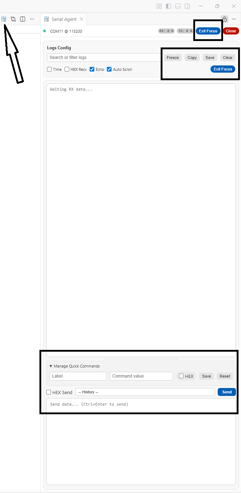
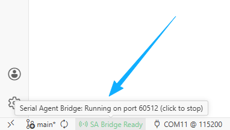
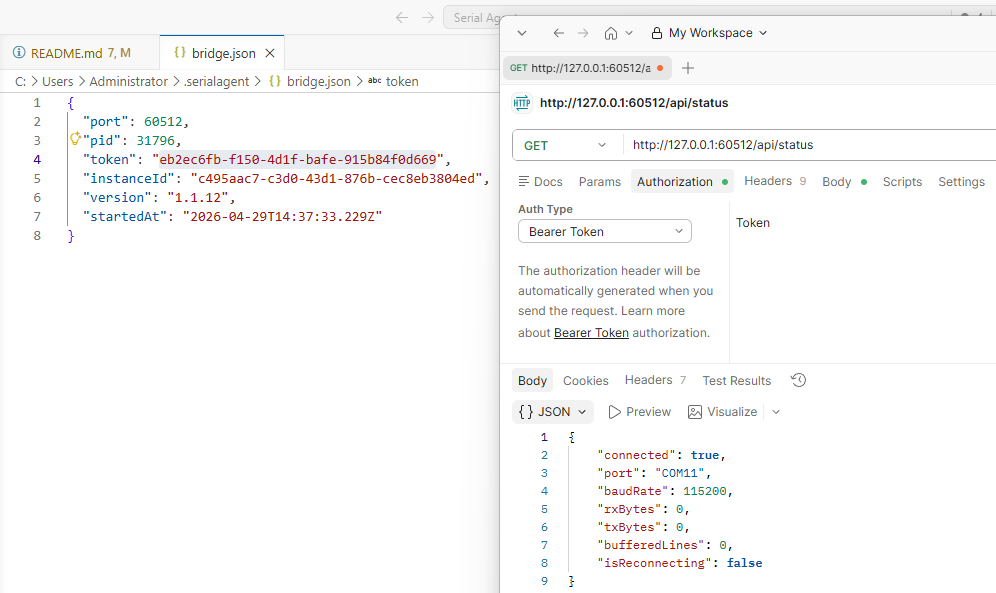
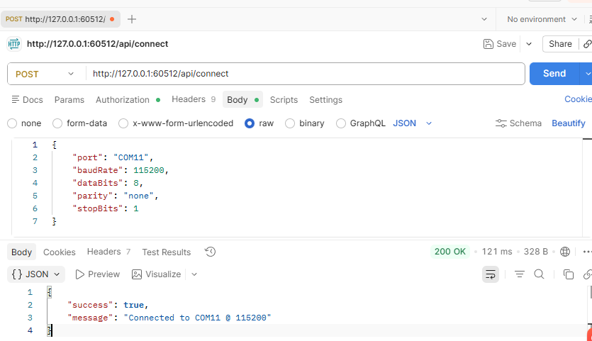
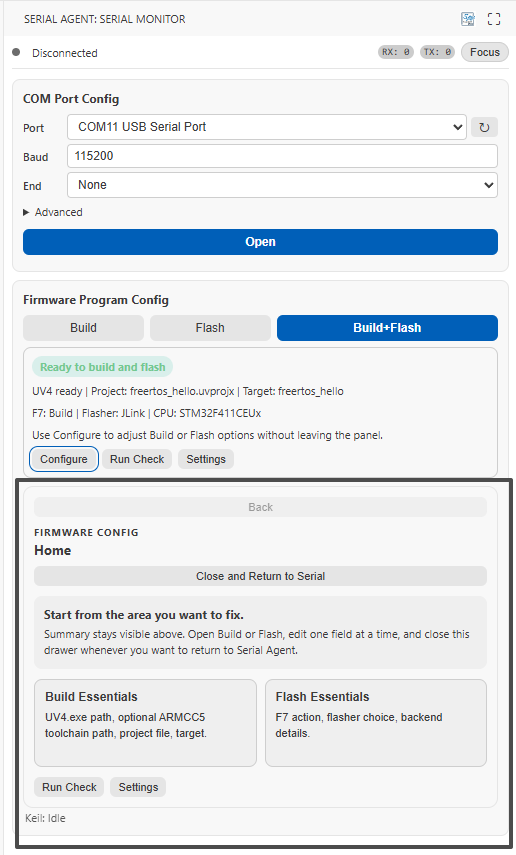
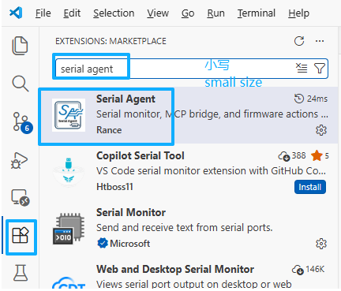

<p align="center">
  
</p>

# Serial Agent VS Code 插件

English version: [README_EN.md](README_EN.md)

`Serial Agent` 是一个面向嵌入式调试场景的 VS Code 插件。它把串口工作台、本地 Bridge 运行时，以及固件构建/烧录入口收拢到同一个工作区里，让你既可以手动完成串口调试，也可以把同一套真实运行时暴露给 AI 客户端。

> [!IMPORTANT]
> 只安装插件，也可以把它当作本地串口工作台和固件动作入口使用。
> 如果你希望接上 AI 闭环，还需要继续配置 `Serial Agent MCP` 和 `Serial Agent Skill`。
> 插件负责本地运行时，MCP 负责把能力暴露给 AI，Skill 负责把工作流约束和使用规则喂给 AI。

源码仓库：

- [https://github.com/Rance-OwO/Serial-Agent](https://github.com/Rance-OwO/Serial-Agent)

## 这个插件是什么

它主要提供三类能力：

- 串口工作台：连接串口、查看 RX 日志、发送 TX 命令、搜索过滤和清空日志
- 本地 Bridge：启动本地 Bridge Server，供AI Agent使用 `Serial Agent MCP` 串口调试工具和烧录工具
- 固件动作入口：在 VS Code 内执行 `Build`、`Flash`、`Build+Flash`，并管理 Build/Flash 配置

## 适合什么场景

- 你只想在 VS Code 里完成串口连接、日志观察和命令发送
- 你希望把串口观测、Keil 构建和烧录动作放到同一个面板里
- 你希望让 AI 通过 MCP 调用真实的本地串口和固件工具链，而不是只读文档

## 功能概览

### 串口工作台

- 在 VS Code 中直接连接和断开串口设备
- 在同一视图里查看 RX 日志并发送 TX 命令
- 支持日志搜索、过滤、清空和 RX/TX 计数
- 支持 `Focus Mode`，把界面收敛到更偏 RX/TX 的调试视角
- 支持在侧边栏使用，也支持通过 `Open Serial Agent` 打开到独立 Tab

<p align="left">
  
</p>

### 本地 Bridge 运行时

- 插件启动本地 Bridge Server，供 `Serial Agent MCP` 调用
- Bridge discovery 信息写入：

```text
~/.serialagent/bridge.json
```

- 插件才是真正持有串口状态、日志缓冲和固件工具链状态的运行时
- 如果插件没有启动，即使 MCP 进程能起来，tool 调用仍然会失败



            

### 固件动作与配置

- 面板顶部执行动作聚焦在 `Build`、`Flash`、`Build+Flash`
- 提供 `Open Build/Flash Config Panel`，用于交互式配置构建和烧录参数
- 提供 `Check Build/Flash Config`，用于在执行前检查配置完整性
- 提供 `Open Keil/Flash Settings` 和 `Select JLink CPU Name` 等辅助命令
- `F7` 动作可配置为仅构建，或构建后立即烧录

当前支持的烧录后端：

- `jlink`
- `stlink`
- `openocd`

<p align="left">
  
</p>

## 安装

### Marketplace

如果你通过 Visual Studio Marketplace 安装本插件，直接搜索 `Serial Agent` 即可。



### VSIX

从远程github仓库拿Release中的 .vsix包在编程工具中进行安装


## 插件快速开始

### 路径 1：把它当作本地串口工作台

1. 在 VS Code 中打开 `Serial Agent` 视图容器。
2. 选择 COM 口和波特率。
3. 点击 `Open` 建立串口连接。
4. 在日志区观察 RX 输出。
5. 在 TX 区发送测试命令。
6. 如需自动烧录，请配置好烧录器。
7. 如果需要，切到 `Focus Mode`，专注查看 RX/TX 调试流。

如果你的目标只是串口连接、日志观察和发命令，到这里就可以开始使用。

### 路径 2.1：把 AI 闭环一起接上(MCP搭建篇)


### 路径 2.2：把 AI 闭环一起接上(SKILL使用篇)

1. 先确认插件已经启动，因为本地 Bridge 和串口运行时都由插件持有。
2. 按 [../serialagent-mcp/README.md](../serialagent-mcp/README.md) 配置 `Serial Agent MCP`。
3. 按 [../serialagent-skill/README.md](../serialagent-skill/README.md) 或 [../serialagent-skill/SKILL.md](../serialagent-skill/SKILL.md) 给 AI 配置 `Serial Agent Skill`。

## 与 MCP / Skill 的关系

这三个部分的职责不同：

- 插件：本地运行时，负责串口、日志、Bridge 生命周期，以及 Keil/Flasher 动作
- MCP：工具暴露层，通过 stdio MCP tools 把插件能力提供给 AI 客户端
- Skill：工作流层，帮助 AI 选择正确工具、判断任务模式，并按证据汇报

它们组成的典型链路是：

```text
AI IDE / Agent Client
    -> Serial Agent MCP
    -> Local Bridge
    -> Serial Agent VS Code Extension
    -> Serial Device / Firmware Toolchain
```

## 固件配置与常用设置

如果你希望在插件里直接执行构建和烧录，通常需要先配置这些基础项：

- `serialagent.keil.projectFile`
- `serialagent.keil.target`
- `serialagent.keil.uv4Path`
- `serialagent.keil.armcc5Path`
- `serialagent.keil.f7Action`
- `serialagent.flash.method`

然后按当前使用的烧录后端继续补齐：

- `serialagent.jlink.*`
- `serialagent.stlink.*`
- `serialagent.openocd.*`

常见入口包括：

- `Serial Agent: Open Build/Flash Config Panel`
- `Serial Agent: Check Build/Flash Config`
- `Serial Agent: Open Keil/Flash Settings`
- `Serial Agent: Select JLink CPU Name`

## 更多文档入口

如果你需要的不只是插件本身，而是完整的本地 AI 调试链路，可以继续阅读：

- 项目总览：[../../README.md](../../README.md)
- MCP 文档：[../serialagent-mcp/README.md](../serialagent-mcp/README.md)
- Skill 文档：[../serialagent-skill/README.md](../serialagent-skill/README.md)

## 开发说明

- 主入口：`src/extension.ts`
- 串口运行时：`src/serial-manager.ts`
- Webview 协调器：`src/serial-panel-provider.ts`
- Bridge 服务：`src/bridge-server.ts`
- 前端资源：`media/main.js`、`media/main.css`

插件构建与打包：

```bash
npm test
npm --workspace packages/serialagent-vscode run build
npm --workspace packages/serialagent-vscode run pack
```
