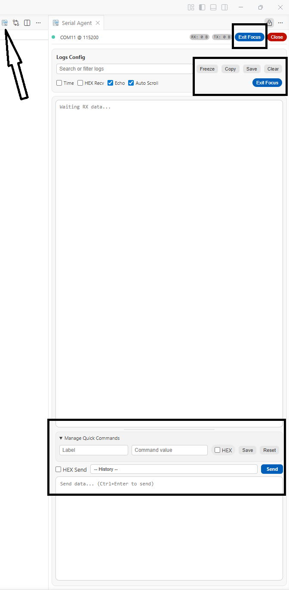
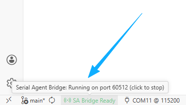
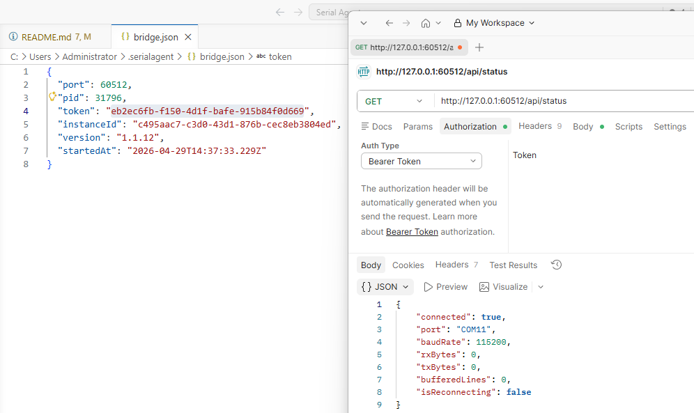
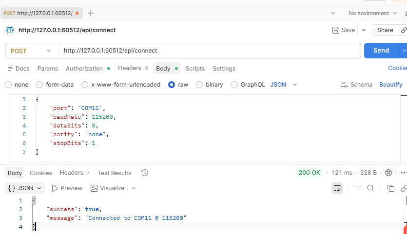
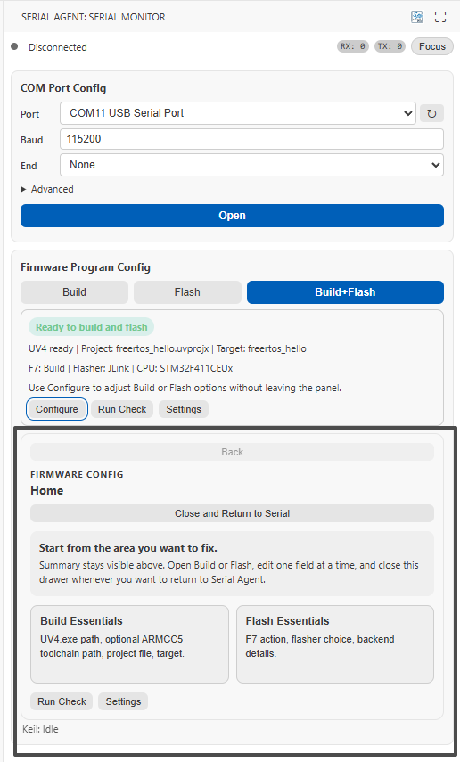
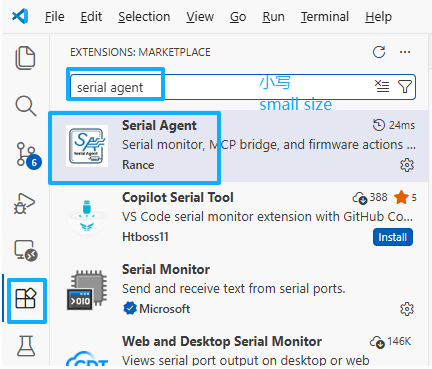

<p align="center">
  
</p>

# Serial Agent VS Code Extension

Chinese version: [README.md](README.md)

`Serial Agent` is a VS Code extension for embedded debugging. It brings a serial workspace, a local Bridge runtime, and firmware build or flash entrypoints into the same workspace, so you can either debug devices manually or expose the exact same real runtime to AI clients.

Source repository:

- <https://github.com/Rance-OwO/Serial-Agent>

> [!IMPORTANT]
> The extension can already be used on its own as a local serial workspace and firmware action entrypoint.
> If you want the AI closed loop, you still need to configure both `Serial Agent MCP` and `Serial Agent Skill`.
> The extension owns the local runtime, the MCP package exposes capabilities to AI clients, and the skill gives the AI workflow rules and usage guidance.

## What This Extension Is

Many serial tools only solve two things: watch logs and send commands. `Serial Agent` goes further by bringing several common parts of an embedded debugging loop into VS Code:

- serial connect, disconnect, log observation, and command sending
- a local Bridge server for `Serial Agent MCP`
- firmware action entrypoints such as `Build`, `Flash`, and `Build+Flash`
- a Build/Flash configuration panel and related helper commands

If you only want to use VS Code as a serial workspace, the extension already works on its own.  
If you want AI to access the same real serial state, log buffer, and firmware actions, continue by wiring in the `MCP` and the `Skill`.

## What Scenarios It Fits

- You want to finish serial connection, log observation, and command sending inside VS Code
- You want serial observation, Keil build, and flash actions in one panel
- You want AI to call the real local serial port and firmware toolchain through MCP instead of only reading docs
- You want to turn "observe logs -> send commands -> analyze -> build or flash if needed -> verify again" into a reusable workflow

## How It Relates To MCP / Skill

These three parts have different responsibilities:

- Extension: the local runtime. It owns serial state, logs, Bridge lifecycle, and Keil or flasher actions
- MCP: the tool exposure layer. It provides the extension capabilities to AI clients through stdio MCP tools
- Skill: the workflow layer. It helps the AI choose the right tools, understand task mode, and report with evidence

Their typical chain looks like this:

```text
AI IDE / Agent Client
    -> Serial Agent MCP
    -> Local Bridge
    -> Serial Agent VS Code Extension
    -> Serial Device / Firmware Toolchain
```

If your goal is only "a local serial tool", you can stop at the extension layer.  
If your goal is "AI participates in the real debugging loop", you need the next two layers as well.

## What You Can Do Directly In The Extension

### Serial workspace

- Connect to and disconnect from serial devices directly inside VS Code
- Inspect RX logs and send TX commands in the same view
- Search, filter, clear logs, and monitor RX/TX counters
- Use `Focus Mode` for a tighter RX/TX-oriented debugging view
- Use it in the sidebar, or open it in a dedicated tab with `Open Serial Agent`

The image below is the serial panel itself. It can be used as a daily serial tool, and it is also the local runtime entrypoint for the full AI debugging chain.

<p align="left">
  
</p>

### Local Bridge runtime

- The extension starts a local Bridge server for `Serial Agent MCP`
- Bridge discovery data is written to:

```text
~/.serialagent/bridge.json
```

- The extension is the real runtime that owns serial state, log buffers, and firmware toolchain state
- If the extension is not running, MCP may start successfully but tool calls will still fail

If you want the AI closed loop later, this Bridge is the key middle layer.  
It is not a normal webpage for direct browser use. It is a local API runtime with authentication.

The following images correspond to Bridge-related learning scenarios:

- first image: the local discovery file `bridge.json`
- second image: the auth prompt when opening a Bridge endpoint directly in a browser
- third image: API testing with a token

<p align="left">
  
</p>

<p align="left">
  
</p>

<p align="left">
  
</p>

### Firmware actions and configuration

- The top action area focuses on `Build`, `Flash`, and `Build+Flash`
- `Open Build/Flash Config Panel` is provided for interactive build and flash configuration
- `Check Build/Flash Config` is provided to validate configuration completeness before execution
- `Open Keil/Flash Settings` and `Select JLink CPU Name` are provided as helper commands
- `F7` can be configured as build only, or build followed by flash

Currently supported flash backends:

- `jlink`
- `stlink`
- `openocd`

The image below shows the Build/Flash-related action entrypoint.  
If you currently only care about serial observation and command interaction, you do not need to configure this first. Enter this part only when the task really requires build or flash.

<p align="left">
  
</p>

## Install

### Option 1: Install from Marketplace

If you install the extension from Visual Studio Marketplace, just search for `Serial Agent`.

This path is the easiest option for regular users.

<p align="left">
  
</p>

### Option 2: Install a VSIX

If you have a `.vsix` file from the Release page, you can install it directly in VS Code.

Common UI steps:

1. Open `Extensions` in VS Code
2. Click the `...` menu in the top-right corner
3. Choose `Install from VSIX...`
4. Select the downloaded `.vsix` file

Or use the command line:

```bash
code --install-extension serialagent-vscode-<version>.vsix
```

This path fits when:

- you are using a GitHub Release artifact
- you want to install a specific fixed version
- Marketplace has not yet updated to the version you want

### Option 3: Build from source

Run the following from the repository root:

```bash
npm install
npm --workspace packages/serialagent-vscode run build
npm --workspace packages/serialagent-vscode run pack
```

The packaged VSIX will be written to `packages/serialagent-vscode/`.

This path fits when:

- you are developing or validating the extension
- you want to install the latest local build from source

## Quick Start

### Path 1: Use it as a local serial workspace

This is the shortest path. You do not need MCP first, and you do not need the Skill first.

1. Open the `Serial Agent` view container in VS Code
2. Select a COM port and baud rate
3. Click `Open` to establish the serial connection
4. Observe RX output in the log area
5. Send test commands from the TX area
6. Switch to `Focus Mode` if you want a more concentrated debugging view

Common entrypoints include:

- `Open Serial Agent`
- `Toggle Focus Mode`
- `Refresh Serial Ports`
- `Disconnect Serial Port`
- `Clear Serial Log`

If your goal is only serial connection, log observation, and command sending, you can already start here.

### Path 2: Add the AI closed loop

If you want AI to actually call local serial and firmware actions instead of only reading the README or guessing from logs, continue with the `Bridge -> MCP -> Skill` chain.

#### Step 1: Make sure the extension is already running

This is the prerequisite for the entire loop.  
The extension must start first, because the Bridge, local serial state, log buffers, and Build/Flash capabilities are all owned by the extension runtime.

You can do either of the following first:

- open `Serial Agent` from the VS Code sidebar
- run `Open Serial Agent` from the command palette

#### Step 2: Confirm that the local Bridge has started

After the extension starts the local Bridge, it writes the discovery file:

```text
~/.serialagent/bridge.json
```

On Windows this usually maps to:

```text
C:\Users\<your-user-name>\.serialagent\bridge.json
```

This file will contain the current Bridge:

- `port`
- `token`
- `pid`
- `startedAt`

Its purpose is not manual editing. Its purpose is to let `Serial Agent MCP` know which local Bridge instance to connect to.

#### Step 3: Understand why opening the Bridge in a browser returns `AUTH_REQUIRED`

Many people first try to open:

```text
http://127.0.0.1:<port>/api/status
```

Then they see something like:

```json
{"success":false,"error":{"code":"AUTH_REQUIRED","message":"Missing Authorization header"}}
```

This is not a failure. It actually proves that the Bridge is already running.  
The reason is that the Bridge is not a normal webpage. It is a local API that requires a `Bearer Token`.

That means:

- opening it directly in the browser address bar is usually not the right path
- PowerShell, curl, Postman, or Apifox can be used for token-based API debugging
- MCP clients also work by reading `bridge.json` first and then calling the Bridge with the token

#### Step 4: Configure `Serial Agent MCP`

Recommended next reading:

- [../serialagent-mcp/README_EN.md](../serialagent-mcp/README_EN.md)
- [../../README_EN.md](../../README_EN.md)

The most common MCP configuration looks like this:

```json
{
  "type": "stdio",
  "command": "npx",
  "args": ["-y", "@ranceowo/serial-agent-mcp"],
  "startup_timeout_sec": 15
}
```

This configuration means:

- the MCP process communicates with the AI client over stdio
- after startup, the MCP process reads `~/.serialagent/bridge.json`
- it forwards tool calls to the local Bridge started by the extension

If the extension is not running, you may see a situation that looks like "MCP is configured, but tool calls still fail".  
That usually does not mean MCP logic is broken. It usually means the extension-side local runtime is not ready yet.

#### Step 5: Feed the `Serial Agent Skill` to the AI

Recommended next reading:

- [../serialagent-skill/README_EN.md](../serialagent-skill/README_EN.md)
- [../serialagent-skill/SKILL.md](../serialagent-skill/SKILL.md)

The `Skill` does not provide runtime capabilities. It helps the AI use this MCP toolset more consistently.  
For example, it helps the AI decide whether the current task is:

- read-only inspection
- open-loop serial interaction
- or a real build / flash / post-flash closed loop

If your AI client supports skill installation, prefer the client's native installation flow.  
If the client does not support skills, you can still feed the contents of `SKILL.md` directly into the model prompt.

#### Step 6: Run one minimal closed-loop verification

Once the extension, MCP, and Skill are all in place, do one minimal verification instead of jumping directly into a complex task.

A typical minimal goal is:

1. confirm that the extension is open
2. confirm that the Bridge discovery file exists
3. let the AI check current serial status through MCP
4. let the AI list serial ports
5. connect to a serial port if needed
6. send one simple command and wait for the response

The point of this step is to verify that the AI is seeing the same real runtime you are using in VS Code, not a simulated environment.

## Advanced Build / Flash Usage

Only enter this section when the task really requires building or flashing firmware.

If you want to execute build and flash actions directly in the extension, you usually need to configure these basics first:

- `serialagent.keil.projectFile`
- `serialagent.keil.target`
- `serialagent.keil.uv4Path`
- `serialagent.keil.armcc5Path`
- `serialagent.keil.f7Action`
- `serialagent.flash.method`

Then continue with the backend-specific settings you actually use:

- `serialagent.jlink.*`
- `serialagent.stlink.*`
- `serialagent.openocd.*`

Common entrypoints include:

- `Serial Agent: Open Build/Flash Config Panel`
- `Serial Agent: Check Build/Flash Config`
- `Serial Agent: Open Keil/Flash Settings`
- `Serial Agent: Select JLink CPU Name`

Suggested order:

1. run `Check Build/Flash Config` first
2. use `Build` when you only need compilation
3. use `Flash` or `Build+Flash` when you need on-board verification

This helps avoid escalating a task that is really just serial interaction into an unnecessary flash loop.

## Common Questions

### 1. Why does opening the Bridge in a browser return `AUTH_REQUIRED`

Because the Bridge is a local API with authentication, not a public webpage.  
If you access it directly without `Authorization: Bearer <token>`, it returns an auth error. This usually means the service is alive, not broken.

### 2. Why do tool calls still fail even though MCP is configured

The common reason is that the extension is not running, or it is running but the Bridge is not ready yet.  
MCP is only the tool exposure layer. The real serial state and toolchain state live in the extension-side local runtime.

### 3. What if `bridge.json` does not exist

First confirm:

- VS Code is open
- the extension is installed and activated
- you have opened the `Serial Agent` panel or otherwise allowed the extension to start normally

If the discovery file is missing, it usually means the Bridge has not started yet, not that the MCP docs are wrong.

### 4. I only want to use it as a serial tool. Do I still need MCP and Skill

No.  
If you only do local serial connection, log observation, and command sending, the extension itself is enough.

### 5. Do I have to configure Build/Flash first

No.  
Only enter that configuration when the task explicitly requires building or flashing firmware. Many daily scenarios only need the serial workspace.

## More Documentation

If you need more than the extension itself and want the full local AI debugging chain, continue with:

- Product overview: [../../README_EN.md](../../README_EN.md)
- MCP docs: [../serialagent-mcp/README_EN.md](../serialagent-mcp/README_EN.md)
- Skill docs: [../serialagent-skill/README_EN.md](../serialagent-skill/README_EN.md)

## Development Notes

- Main entrypoint: `src/extension.ts`
- Serial runtime: `src/serial-manager.ts`
- Webview coordinator: `src/serial-panel-provider.ts`
- Bridge server: `src/bridge-server.ts`
- Frontend assets: `media/main.js`, `media/main.css`

Build and package the extension with:

```bash
npm test
npm --workspace packages/serialagent-vscode run build
npm --workspace packages/serialagent-vscode run pack
```
